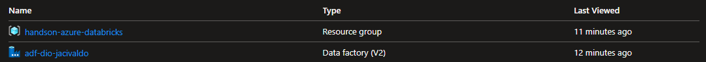
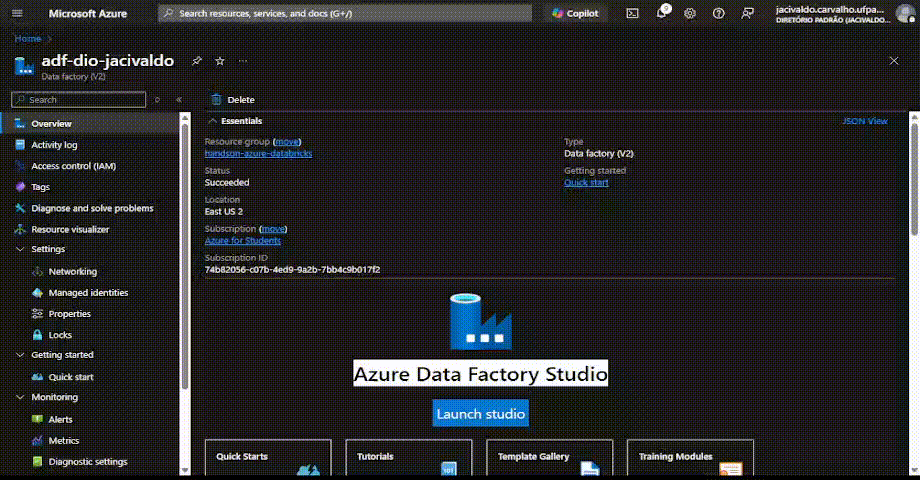
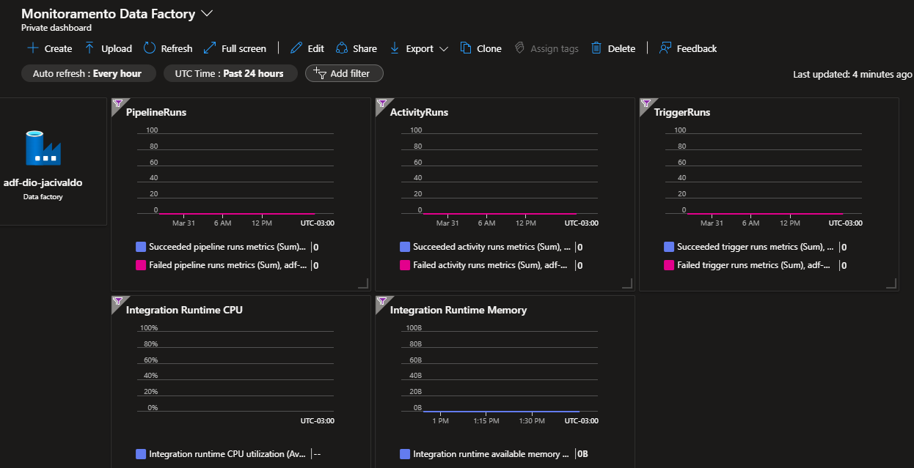

# Criando um Dashboard de Monitoramento no Azure Data Factory

## Visão Geral

Este projeto demonstra como criar um **Dashboard de Monitoramento** para o **Azure Data Factory**, utilizando recursos e gráficos essenciais para acompanhar e otimizar os processos de integração de dados na plataforma. A solução é projetada para proporcionar visibilidade em tempo real de métricas importantes, como execuções de pipelines, atividades, triggers e o uso de recursos de **Integration Runtime**.

## Objetivos do Projeto

- **Criação de Recursos no Azure**: O projeto abrange desde a criação do grupo de recursos até a implementação do Azure Data Factory.
- **Monitoramento**: Será possível acompanhar o desempenho e a saúde de atividades e triggers.
- **Uso de Gráficos e Métricas**: Utilização de gráficos detalhados para acompanhar o consumo de recursos e a execução de tarefas.

### Tecnologias Utilizadas:
- **Azure Data Factory**: Para orquestrar e automatizar processos de dados.
- **Azure Dashboards**: Para visualização e monitoramento em tempo real.

## Passo 1: Criação do Grupo de Recursos e Data Factory

O primeiro passo envolve a criação de um **Grupo de Recursos** e a **instanciação do Azure Data Factory**. O Data Factory é uma ferramenta fundamental para mover e transformar dados de forma escalável. Para configurar o ambiente, criamos o grupo de recursos e o recurso de Data Factory:

<figure style="text-align: center;">
    
    <figcaption> Criação do Grupo de Recursos e Data Factory.</figcaption>
</figure>

## Passo 2: Adição de Recursos ao Dashboard de Monitoramento

Depois de configurar o Data Factory, o próximo passo é integrar os recursos de monitoramento ao dashboard. O objetivo é garantir que você possa monitorar diversos aspectos, como a execução de pipelines, atividades, triggers e o uso de recursos, com visualizações claras e práticas.

Os elementos que são adicionados ao painel incluem:

- **PipelineRuns**: Monitoramento da execução dos pipelines, exibindo tempo de execução e status.
- **ActivityRuns**: Visualização do status e tempo das atividades dentro dos pipelines.
- **TriggerRuns**: Informações sobre a execução dos triggers (gatilhos) que iniciam os pipelines.
- **Integration Runtime CPU e Memory**: Acompanhamento do uso de CPU e memória dos recursos de execução do Integration Runtime.

<figure style="text-align: center;">
    
    <figcaption> Adicionando os recursos ao Dashboard de Monitoramento Data Factory.</figcaption>
</figure>

## Passo 3: Resultado Final do Dashboard

Após a configuração e integração dos diversos recursos ao dashboard, o resultado final é um painel completo que permite a visualização e monitoramento detalhado de todos os aspectos do Azure Data Factory.

<figure style="text-align: center;">
    
    <figcaption> Resultado final do Dashboard de Monitoramento no Data Factory.</figcaption>
</figure>

## Insights e Possibilidades Aprendidas

Durante a execução deste projeto, alguns pontos importantes foram aprendidos:

1. **Automatização e Eficiência**: A criação de dashboards personalizados no Azure Monitor não só melhora a visibilidade sobre as operações do Data Factory, mas também oferece uma maneira eficiente de identificar problemas e otimizar processos.
   
2. **Escalabilidade e Flexibilidade**: O Azure Data Factory permite a manipulação de grandes volumes de dados e a automação de processos complexos de integração, com escalabilidade ajustável às necessidades da empresa.

3. **Alertas e Proatividade**: A adição de monitoramento e métricas no dashboard facilita a detecção precoce de problemas, permitindo ações proativas antes que impactem negativamente a operação.

4. **Aprofundamento no Azure Monitor e Dashboards**: Este projeto aprofundou o conhecimento sobre o Azure Monitor, uma ferramenta poderosa para coletar e agir sobre dados operacionais. Além disso, aprendi sobre a personalização de dashboards com diversas métricas e a integração com outras ferramentas de visualização como o Grafana.

## Conclusão

A criação deste **Dashboard de Monitoramento** para o **Azure Data Factory** é uma solução poderosa para equipes de TI e dados que buscam otimizar seus processos de integração e garantir que os pipelines e atividades estejam operando corretamente. Além de fornecer uma visão clara e em tempo real da saúde dos processos, a integração com métricas de uso de recursos oferece uma visão holística da performance da solução.

Para mais informações sobre Azure Data Factory, consulte a [documentação oficial do Azure](https://learn.microsoft.com/azure/data-factory/introduction).

## Contribuições

Se você tiver sugestões de melhorias ou encontrar problemas com o script, sinta-se à vontade para abrir um **issue** ou submeter um **pull request**.

## Contatos e Network

- **LinkedIn**: [LinkedIn](https://www.linkedin.com/in/jacivaldocarvalho/) 👔
- **E-mail**: [E-mail](mailto:jacivaldocarvalho@gmail.com) 📧
- **GitHub**: [GitHub](https://github.com/jacivaldocarvalho) 🐙
- **Medium**: [Medium](https://medium.com/@jacivaldocarvalho) ✍️

Sempre aberto a novas conexões e oportunidades de aprendizado!

## Licença

Este projeto está licenciado sob a [MIT License](LICENSE).