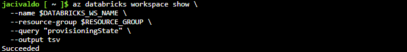
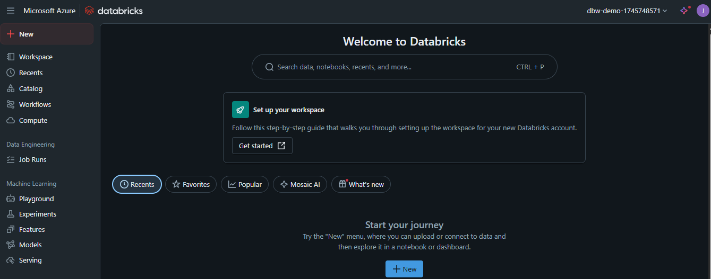
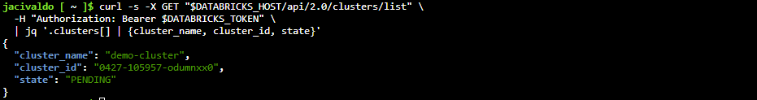
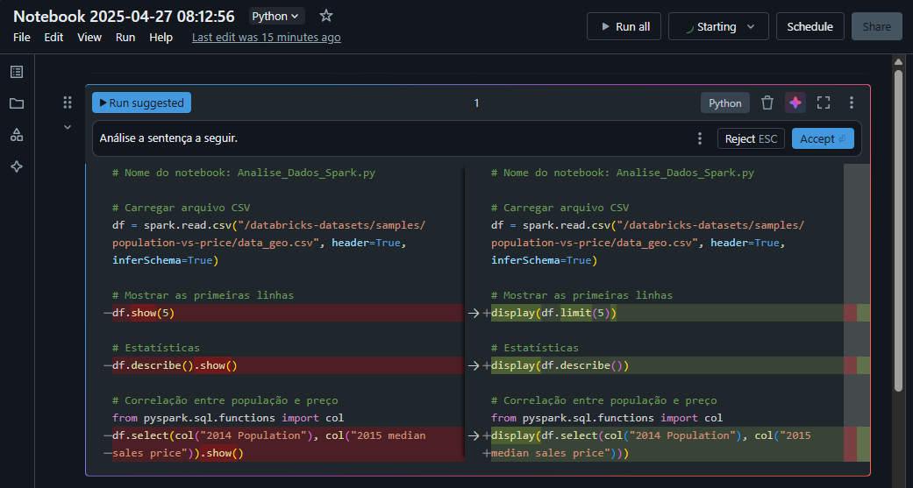

# 🚀 Automação, Análise e Controle de Versão com Azure Databricks

Este projeto demonstra como **automatizar a criação de ambientes no Azure Databricks**, aplicar **análise de dados com Apache Spark**, e controlar versões com **GitHub** — tudo com **Shell Scripts, REST API e práticas modernas** de Data Engineering.


## 💡 Introdução ao Azure Databricks

O [**Azure Databricks**](https://learn.microsoft.com/en-us/azure/databricks/) é uma plataforma de análise de dados baseada no **Apache Spark**, totalmente integrada ao Azure. Ela oferece:

- Notebooks colaborativos
- Suporte a linguagens como Python, SQL e Scala
- Integração com GitHub
- Autoscaling de clusters
- IA assistente integrada para análises


## 🛠️ Etapa 1 – Provisionamento Automatizado com Azure CLI

Criação automática de ambiente via **Shell Script**:

```bash
# Variáveis de ambiente
RESOURCE_GROUP="rg-databricks-demo"
LOCATION="eastus"
DATABRICKS_WS_NAME="dbw-demo-$(date +%s)"

# Criar Resource Group
az group create --name $RESOURCE_GROUP --location $LOCATION

# Criar Workspace do Databricks
az databricks workspace create \
  --resource-group $RESOURCE_GROUP \
  --name $DATABRICKS_WS_NAME \
  --location $LOCATION \
  --sku standard

echo "Databricks Workspace '$DATABRICKS_WS_NAME' criado com sucesso."
```

<figure style="text-align: center;">
    
    <figcaption>Verificando o status do workspace do Databricks criado via shell.</figcaption>
</figure>

<figure style="text-align: center;">
    
    <figcaption>Workspace do Databricks criado via shell.</figcaption>
</figure>


## 🔑 Etapa 2 – Gerando Token de Acesso Seguro

Para interagir com a API do Databricks, gere seu token de acesso:

1. Acesse: `https://<workspace>.azuredatabricks.net`
2. Perfil → **User Settings** → **Access Tokens**
3. Clique em **Generate New Token**
4. Nomeie e defina expiração
5. Copie e armazene com segurança

### 💡 Dica Profissional

Evite hardcode de tokens em scripts. Use variáveis de ambiente:

```bash
export DATABRICKS_TOKEN="seu-token-aqui"
```


## ⚙️ Etapa 3 – Criação de Cluster via API REST

Criação de cluster usando `curl` com autenticação:

```bash
DATABRICKS_HOST="https://$DATABRICKS_WS_NAME.azuredatabricks.net"
DATABRICKS_TOKEN="<SEU_TOKEN_DATABRICKS>"

curl -X POST $DATABRICKS_HOST/api/2.0/clusters/create \
  -H "Authorization: Bearer $DATABRICKS_TOKEN" \
  -H "Content-Type: application/json" \
  -d '{
        "cluster_name": "demo-cluster",
        "spark_version": "12.2.x-scala2.12",
        "node_type_id": "Standard_DS3_v2",
        "num_workers": 2,
        "autotermination_minutes": 20
      }'
```

Consulta de cluster criado:

```bash
curl -s -X GET "$DATABRICKS_HOST/api/2.0/clusters/list" \
  -H "Authorization: Bearer $DATABRICKS_TOKEN" \
  | jq '.clusters[] | {cluster_name, cluster_id, state}'
```

<figure style="text-align: center;">
    
    <figcaption>Consulta do demo-cluster criado.</figcaption>
</figure>


## 📊 Etapa 4 – Análise de Dados com Apache Spark + IA

Notebook de análise com **Spark**:

```python
# Nome do notebook: Analise_Dados_Spark.py

df = spark.read.csv("/databricks-datasets/samples/population-vs-price/data_geo.csv", header=True, inferSchema=True)

df.show(5)
df.describe().show()

from pyspark.sql.functions import col
df.select(col("2014 Population"), col("2015 median sales price")).show()
```

<figure style="text-align: center;">
    
    <figcaption>Utilizando o assistente de IA.</figcaption>
</figure>

### ✅ Melhorias com IA do Databricks:

| Antes | Depois (com IA) | Benefício |
|-------|------------------|-----------|
| `df.show(5)` | `display(df.limit(5))` | Visual interativo com filtros |
| `df.describe().show()` | `display(df.describe())` | Estatísticas mais legíveis |
| `df.select(...)` | `display(...)` | Geração automática de gráficos |


## 🔁 Etapa 5 – Controle de Versão com GitHub

Integração com GitHub direto do notebook:

1. No notebook → **Git** → **Link notebook to Git repo**
2. Configure com seu GitHub Token
3. Faça commits e versionamento pelo Databricks


## ✅ Resumo Profissional

Este projeto demonstra na prática:

- Criação de ambientes com **Azure CLI**
- Uso da **API REST do Databricks**
- Análise de dados com **Apache Spark**
- Visualizações e insights com **IA integrada**
- Integração com **GitHub** para versionamento


## 💡 Insights Relevantes

- ⚡ **Automação acelera o setup** e reduz erros em ambientes de dados
- 🔍 **display() melhora a experiência visual** sem dependência de ferramentas externas
- 🤖 **IA do Databricks ajuda a aplicar boas práticas**
- 🔁 **GitHub permite colaboração e rastreabilidade do código**


## 🚀 Próximos Passos (Sugestões Profissionais)

- Integrar com **Azure Data Lake** para dados em produção  
- Criar dashboards em **Power BI** conectados ao Databricks  
- Testar o uso de **Delta Lake** e controle de versão dos dados  
- Explorar **MLflow** para experimentos de Machine Learning  


## 📚 Referências Técnicas

- 📘 [Microsoft Learn: Transform Data in Azure Databricks](https://microsoftlearning.github.io/mslearn-databricks/Instructions/Exercises/LA-03-Transform-data.html)  
- 📘 [Documentação Oficial do Azure Databricks](https://learn.microsoft.com/en-us/azure/databricks/)  
- 🧠 [API REST Databricks](https://docs.databricks.com/api/index.html)  
- 🧪 [Dataset population-vs-price](https://www.databricks.com/resources/datasets/population-vs-price)  
- 🐚 [Azure CLI Docs](https://learn.microsoft.com/pt-br/cli/azure/install-azure-cli)  
